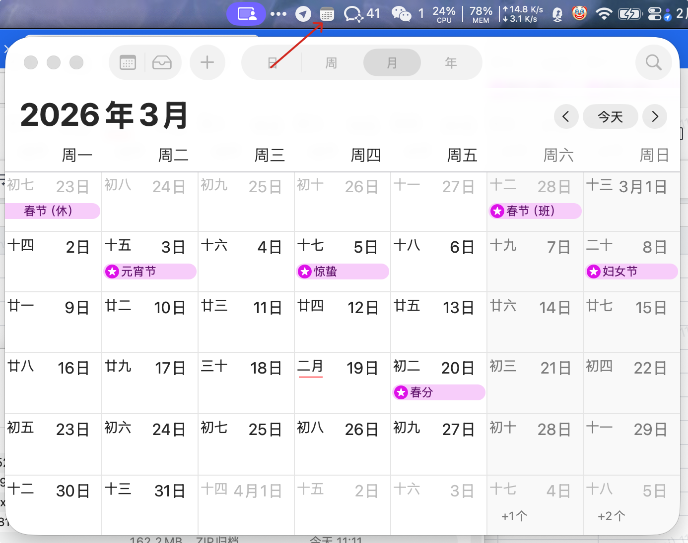

# BarPin

BarPin 是一款“可承载 App 的菜单栏气泡工具”。  
它可以把常用 App 变成贴近菜单栏的独立气泡入口：点击图标快速唤起/隐藏，窗口大小可记忆，视觉上始终与菜单栏按钮保持关联。

English version: [README.en.md](README.en.md)

Slogan：你的摸鱼神器，把常用 App 固定在菜单栏气泡里。



## 功能特性

- 支持多个独立 Pin（每个 App 一个菜单栏图标）
- 每个 Pin 独立快捷键（可不设置）
- 快捷键冲突检测（冲突时阻止保存）
- 智能切换行为：
  - App 在前台：点击/快捷键会隐藏
  - App 在后台：点击/快捷键会提到最前
  - App 无可见窗口：自动尝试重新拉起并定位
- 每个 App 独立记忆窗口大小
- 图标模式可切换（App 图标 / Pin 图标，灰色 / 彩色）
- 中英文切换
- 调试日志开关
- 管理页支持统一管理所有 Pin（新增/删除/快捷键/图标设置）

## 首次启动的重要说明（请务必阅读）

由于 BarPin 当前未经过 Apple Developer ID 签名与公证，macOS 可能在首次打开时提示“已损坏”或“无法验证开发者”。  
这是系统标准安全策略，并不等同于应用存在恶意行为。请按以下方式手动允许运行：

1. 在 Finder 中右键（或按住 Control 点击）`BarPin.app`，选择“打开”。
2. 在弹窗中再次点击“打开”。
3. 若仍被拦截，前往“系统设置 > 隐私与安全性”，在“安全性”区域点击“仍要打开”。

完成一次手动允许运行后，后续启动通常不会再提示。

> 更新提醒：当前为未签名/未公证版本。每次替换 `BarPin.app` 后，macOS 可能将其视为新应用，需要重新执行“允许运行”与“辅助功能”授权。若“辅助功能”列表已有旧 BarPin 条目，请先删除旧条目，再重新添加并勾选新版本。

## 权限要求

BarPin 依赖辅助功能（Accessibility）来控制外部窗口的移动、缩放与聚焦。首次运行请在以下位置授权：

- 系统设置 > 隐私与安全性 > 辅助功能

## 运行方式

本项目是 SwiftPM 可执行程序。可在 Xcode 打开目录运行，或命令行执行：

```bash
swift run
```

## 自动化测试

### 逻辑检查（可在 CI 跑）

```bash
swift run BarPinCoreChecks
```

### 本地 E2E（管理窗口重开链路）

```bash
APP_PATH=dist/BarPin.app scripts/e2e_barpin.sh
```

说明：
- 该脚本依赖 macOS 辅助功能与自动化权限（System Events）。
- 主要验证“BarPin 运行中再次打开 App 可拉起管理窗口”。

## 项目结构

- `Package.swift`：SwiftPM 配置
- `Sources/BarPin/main.swift`：主程序逻辑
